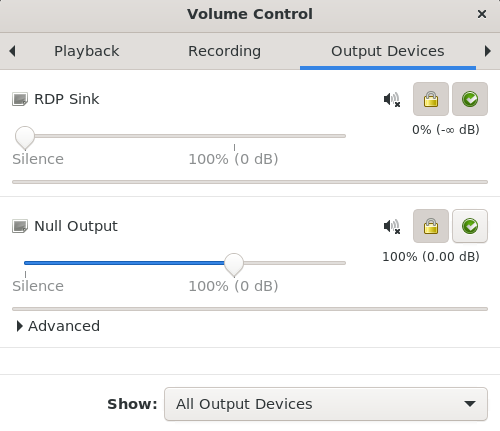
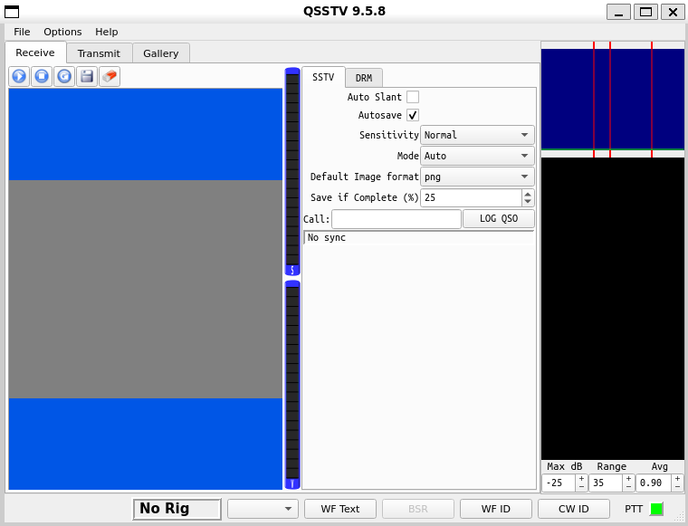
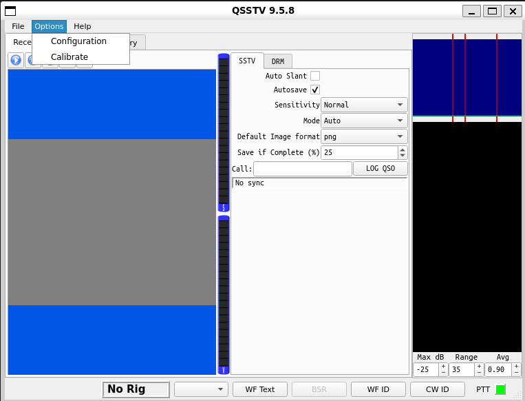
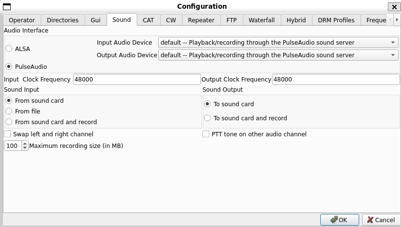
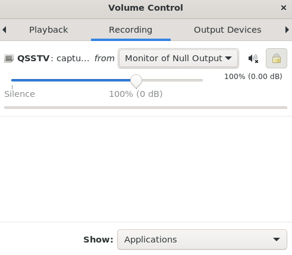
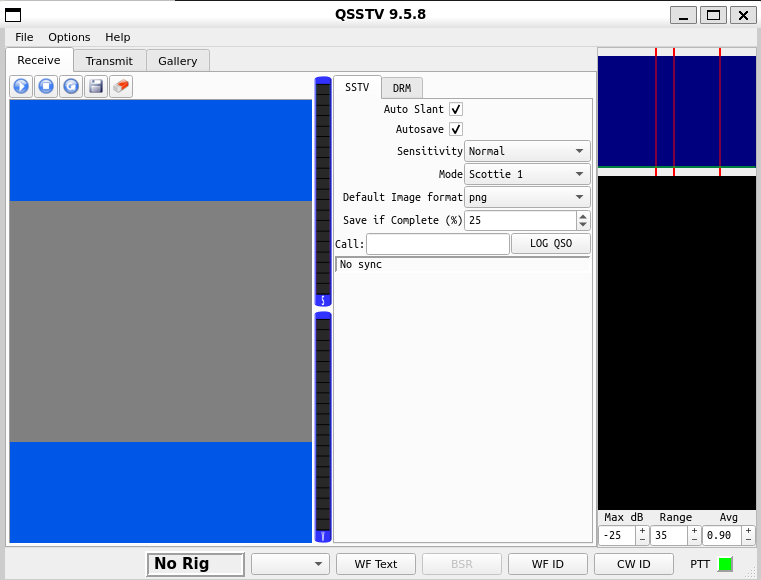
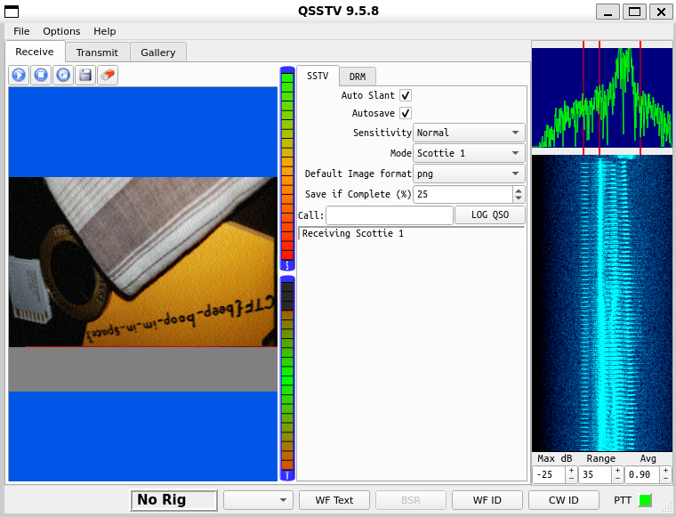

# m00nwalk

## Challenge Description

Decode this *message* from the moon.

## Hints
	- How did pictures from the moon landing get sent back to Earth?
	- What is the CMU mascot?, that might help select a RX option

## Thought Process

The challenge is to decode the attached sound file which is in .wav format. I downloaded the file and listened to the audio which was nothing but beeps. Needless to say, listening to it wasn't of any help. Then I took a look at the hints and I googled the first hint i.e, "How did pictures from the moon landing get sent back to Earth?". I came to know about SSTV (Slow Scan Television) signals which basically is a method of sending images over radio, and is common in amateur radio and CTF challenges. I figured there will be a hidden image in the audio which I'll have to obtain by decoding the SSTV signal in the audio. After watching a lot of YouTube tutorials I got a faint idea on how on decoding SSTV signals using QSSTV, a program used for receiving and decoding SSTV signals. 
Firstly, I'll have to install QSSTV. After that a virtual audio cable should be set up so that I can play the audio file through it, allowing QSSTV to “hear” and decode the sound without any physical cables or speakers. The next thing I've to install is PulseAudio Volume Control which is a tool that'll control which audio device QSSTV listens to. In this case, I want QSSTV to listen to the virtual cable that is set up. Once that's done, I'll have to launch `qsstv` and go to Options → Configuration → Sound and select PulseAudio as the Audio Interface. This is done so that QSSTV know where to “listen” for the audio and selecting PulseAudio tells QSSTV to use the virtual cable. After that `pavucontrol` should be launched in which I've to set QSSTV to listen to the “Null Output” device (virtual cable) in the Recording tab. This links QSSTV to the virtual cable, so when the audio plays through it, QSSTV can receive and decode it. Now I've to go back to QSSTV and select an appropriate mode. This is where the second hint comes to play. The CMU mascot is Scotty the Scottie Dog (found by googling) which hints towards the Scottie modes in SSTV. After that's done, I've to enable Auto Slant since it improves the quality of the decoded image by automatically compensating for any skew or distortion that might occur during the transmission of the SSTV signal. Finally the audio file can be played through QSSTV which will decode the hidden image

## Solution

I installed QSSTV using `apt-get install qsstv` and PulseAudio Volume Control using `apt install pavucontrol`.
To set up the virtual audio cable, I used the following command
```bash
pactl load-module module-null-sink sink_name=virtual-cable
```

I launched PulseAudio Volume Control using the command `pavucontrol`


After that I launched QSSTV using the command `qsstv`


Once launched, I did the following:
Options → Configuration → Sound → Select PulseAudio as the Audio Interface


Click Ok.

Then I went back to PulseAudio and in the Recording tab, I set QSSTV to  “Monitor of Null Output”


To set the mode I went back to QSSTV and selected Scottie 1 mode under Mode and enabled Auto Slant


To play the audio file, I executed `paplay -d virtual-cable message.wav` which gave me the following output


Thus the flag for this challenge is picoCTF{beep_boop_im_in_space}

## Concepts Learned

	- SSTV (Slow Scan Television) signalsare used to send images over radio, and is common in amateur radio 
	- QSSTV is a program used for receiving and decoding SSTV signals
	- A virtual audio cable can be set up using PulseAudio Volume Control which is a tool for routing audio between different applications

## Incorrect Tangents

Initially I tried using the wrong SSTV modes without paying attention to the hint and thus wasted a lot of time
